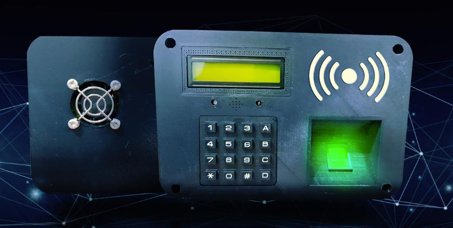
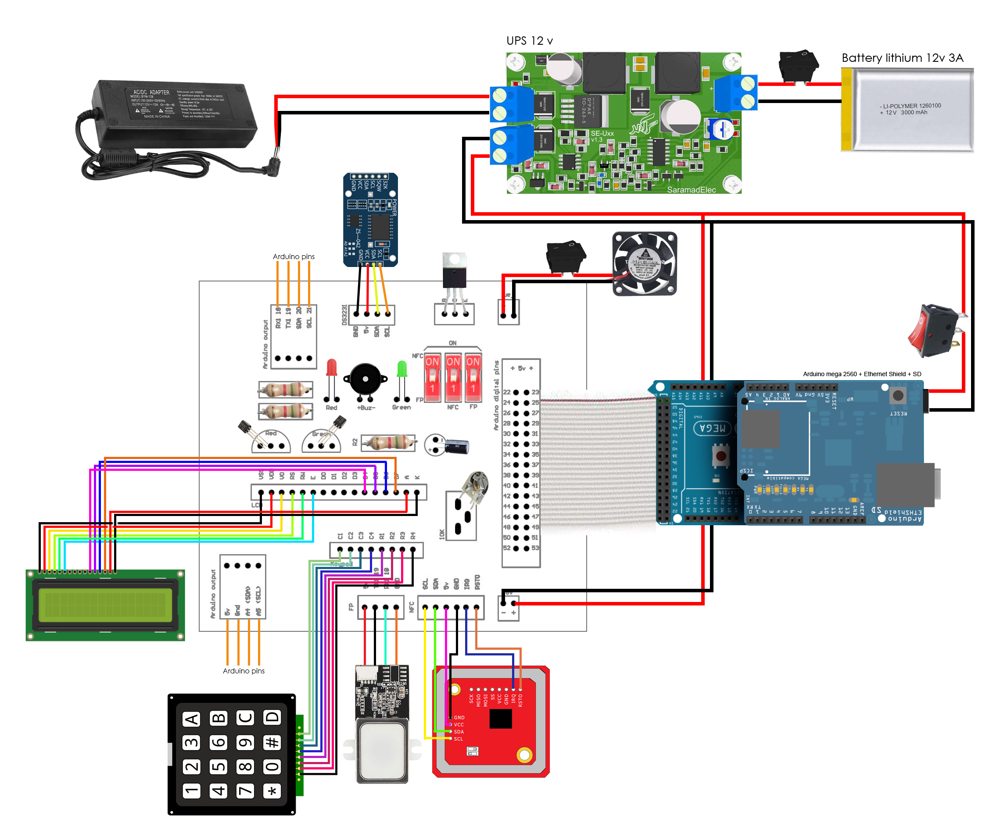
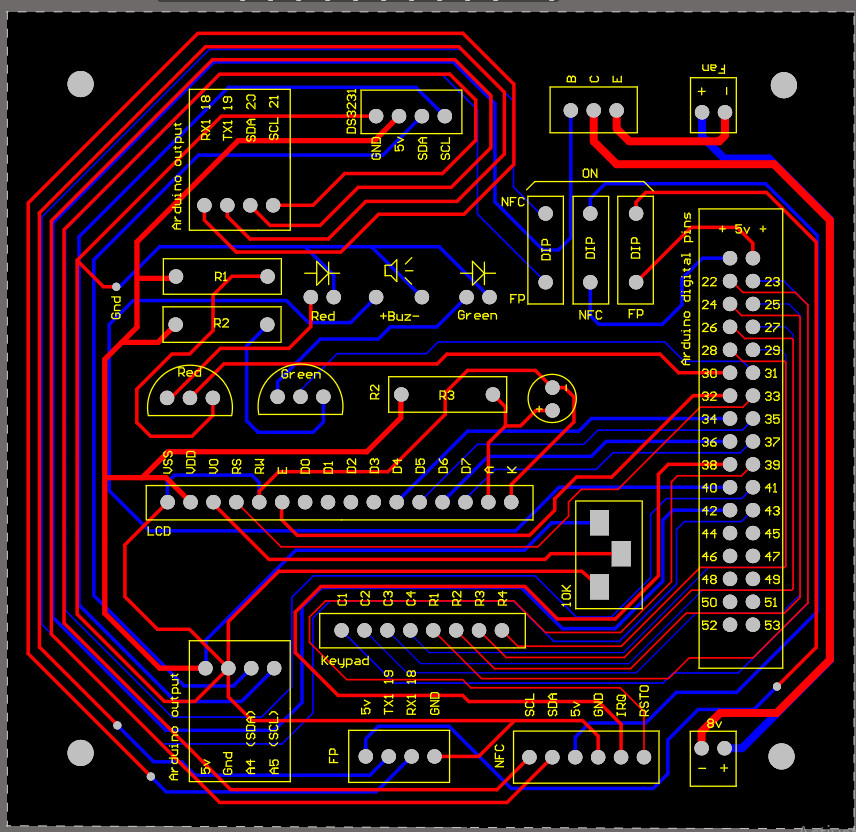
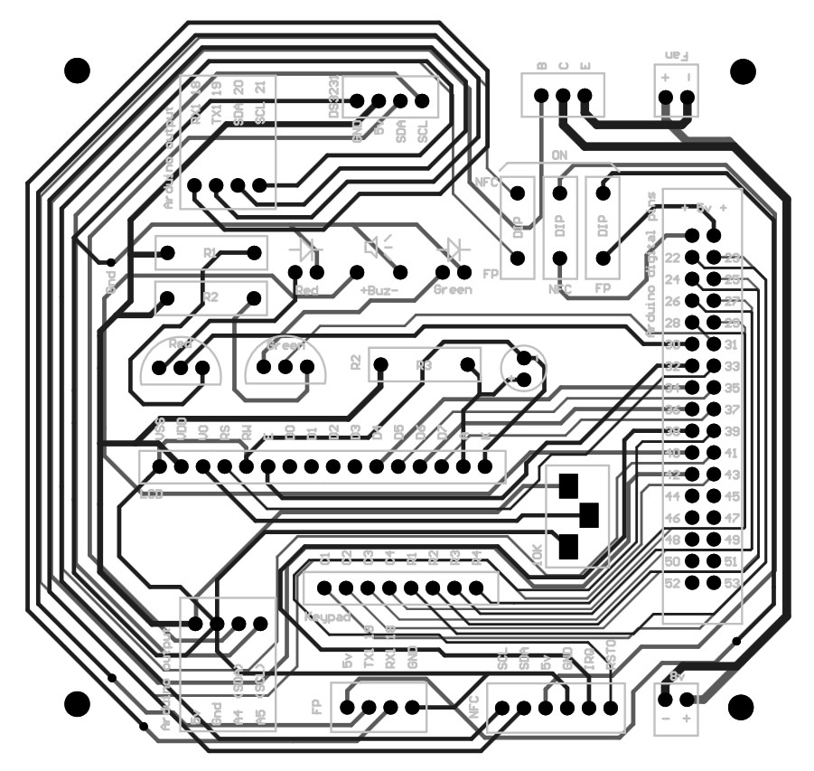

# Attendance Device V2

C++ Attendance Device project witch FingerPrint and NFC Card Reader with modules `Arduino mega 2560` and `Arduino Ethernet shield w5100`, `NFC PN V3` and `Fingerprint ZFM60`.

## needed files

:warning: All the needed files, Altium PCB circuit, 3D model case and Flowchart are in `FILES` directory 

## Authors

- [@irpcpro](https://github.com/irpcpro)

## Requirements

- Cinema 4D (if you want `to edit the case of the device)
- Altium Designer (if you want to edit the PCB circuit of the device)
- Visual Studio Code [with  PlatformIO plugin]

## Demo

`Video` How to Design and make Attendance device

- [Youtube video](https://www.youtube.com/watch?v=_ly7LJzFc-U)

## Needed Architecture 

- CPU Architecture : `32 bit`
- OS/ABI: `UNIX - System V`
- Machine: `Atmel AVR 8-bit microcontroller`
- Version: `0x1`

## Needed Devices

| row | Module                                         | count |
|----:|------------------------------------------------|-------|
|   1 | 100K Ω Variable Resistor                       | 1     |
|   2 | 3-pin light switch                             | 1     |
|   3 | Arduino mega 2560                              | 1     |
|   4 | LCD 2 in 16                                    | 1     |
|   5 | DS3231 RTC                                     | 1     |
|   6 | 3V Lithium battery for RTC                     | 1     |
|   7 | Buzzer                                         | 1     |
|   8 | 100 ohm resistance                             | 1     |
|   9 | LED Red                                        | 1     |
|  10 | LED Green                                      | 1     |
|  11 | DIP Switch                                     | 3     |
|  12 | Pcs Female Spade Terminal Connector            | 10    |
|  13 | 2 Pin Crooked Jack Male                        | 5     |
|  14 | Keypad 4X4 Matrix Black 16-Button              | 1     |
|  15 | arduino ethernet shield w5100                  | 1     |
|  16 | NFC PN v3                                      | 1     |
|  17 | Fan 4 in 4                                     | 1     |
|  18 | Fan protector 4 in 4                           | 1     |
|  19 | DC Power Jack Adapter Male and female          | 1     |
|  20 | Flat cable 17 pin                              | 1     |
|  21 | Box Header + IDC 17PIN                         | 1     |
|  22 | 40 Pin 2.54mm 20mm Long Header Pins Male       | 1     |
|  23 | 40 Pin 2.54mm 15mm Pins Male                   | 1     |
|  24 | Micro SD Ram 8Gig                              | 1     |
|  25 | 2-Pin KCD3-101 On/Off Rocker Switch            | 2     |
|  26 | Transistor 2n222                               | 2     |
|  27 | Fingerprint ZFM60                              | 1     |
|  28 | Adaptor 12v 10Amp                              | 1     |
|  29 | Lithium battery 12v 3Amp                       | 1     |
|  30 | Screw                                          | n     |
|  31 | Wire red and blue 0.4mm (each 3 meters)        | 1     |
|  32 | Board UPS DC 12v model 712                     | 1     |
|  33 | Transistor TIP41c                              | 1     |
|  34 | Diode 16V 330uf                                | 1     |
|  35 | 4-pin board connector Smooth male and female   | 2     |
|  36 | Connector Header male and female (22-05-3041)  | 2     |
|  37 | LM2596 2Amp                                    | 1     |

## Main Circuit

## PCB board

